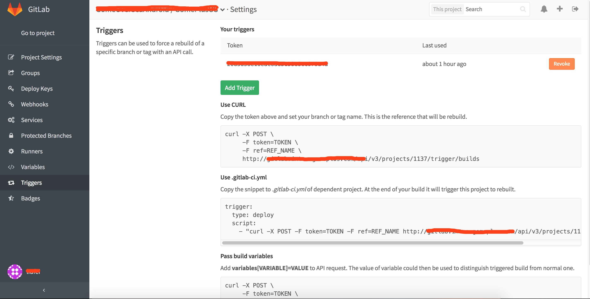
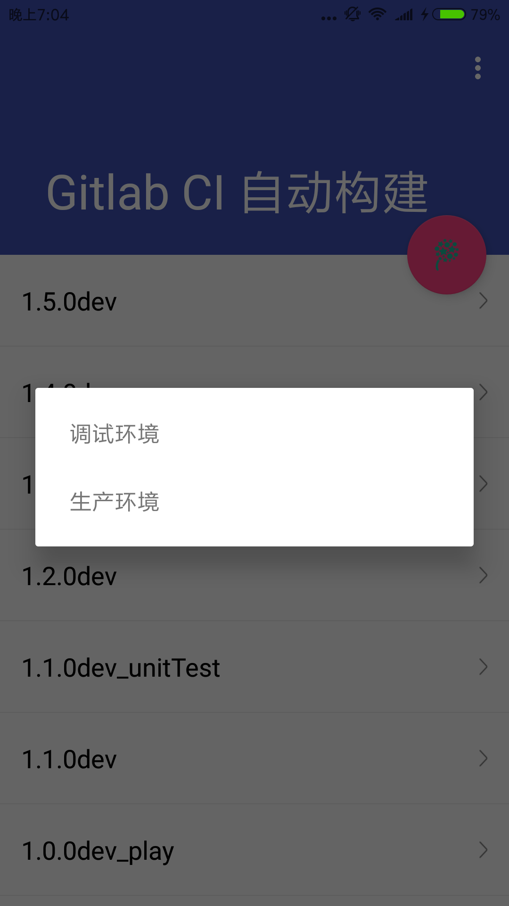

# Gitlab-CI-Auto-Build
Gitlab CI自动构建流程，支持打包，上传，发送邮件，单元测试

功能
---
1. 提供对多环境打包的支持；
2. 提供对第三方应用托管平台的上传功能，如[蒲公英](https://www.pgyer.com)等(api支持Linux下的crul命令即可)；
3. 支持构建完成发送邮件；
4. 支持单元测试；  

配置流程
-------
工程根目录下[.gitlab-ci.yml](.gitlab-ci.yml)  

```perl
stages:          # 创建四个流程
  - buildApk     # 编译安装包
  - uploadApk    # 上传安装包
  - notify       # 发送邮件通知
  - test         # 触发单元测试
mxBuildJob:
  stage: buildApk
  script:
    # 创建apk输出路径
    - mkdir -p app/build/outputs;
    # triggers触发时，如果参数中包含RELEASE_BUILD，则执行脚本gitlabci/build_release_apk_script.sh  
    - if [ -n "${RELEASE_BUILD}" ];     then source gitlabci/build_release_apk_script.sh; fi;
    # triggers触发时，如果参数中包含DEBUG_BUILD，则执行脚本gitlabci/build_debug_apk_script.sh 
    - if [ -n "${DEBUG_BUILD}" ]; then source gitlabci/build_debug_apk_script.sh; fi;
  artifacts:
    paths:
      # 设置输出路径 
      - app/build/outputs/
  only:
    - triggers
  tags:
    - android
mxUploadApkJob:
  stage: uploadApk
  script:
    # mxBuildJob成功后执行
    - if [ -n "${RELEASE_BUILD}" ];     then source gitlabci/upload_apk_release_script.sh; fi;
    - if [ -n "${DEBUG_BUILD}" ]; then source gitlabci/upload_apk_debug_script.sh; fi;
  when: on_success
  only:
    - triggers
  tags:
    - android
mxBuildSuccessNotifyJob:
  stage: notify
  when: on_success
  script:
      # apk上传成功后执行发送邮件脚本
      - source gitlabci/send_email_success_script.sh;
  when: on_success
  only:
      - triggers
  tags:
    - android
mxUnittestJob:
  stage: test
  only:
      - triggers
  script:
  	   # mxBuildSuccessNotifyJob执行完成之后，开始单元测试
      - source gitlabci/android_test_script.sh;
  tags:
      - android

```

触发请求  
1. GitLab服务端 Settings --> Triggers，获取trigger信息:token, 选择CURL方式进行trigger触发，ref为对应的分支名称  

```perl
curl -X POST \
     -F token=TOKEN \
     -F ref=REF_NAME \
     http://gitlab.intra.gomeplus.com/api/v3/projects/1137/trigger/builds
```  

2. app代码中创建post请求  

```java
public interface BuildService {
    @FormUrlEncoded
    @POST("v3/projects/1137/trigger/builds")
    Call<BuildResponse> postBuildRequest(
            @Field("token") String token,
            @Field("ref") String branch,
            @Field("variables[RELEASE_BUILD]") String onlineBuild,
            @Field("variables[DEBUG_BUILD]") String devBuild);
}
```  



